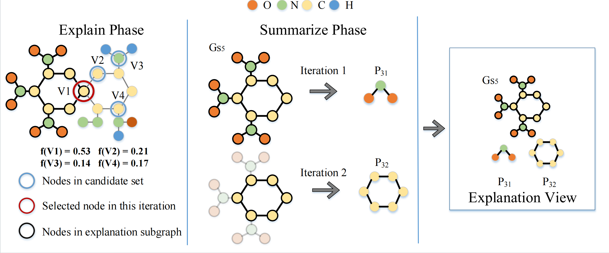

# GVEX
This repository contains the source code for our paper: **View-based Explanations for Graph Neural Networks,** SIGMOD 2024, by Tingyang Chen, Dazhuo Qiu, Yinghui Wu, Arijit Khan, Xiangyu Ke, Yunjun Gao

# Requirements
-------
- Pytorch 1.13.0
- PyG 2.2.0

--------

# Datasets
----------
We use the following datasets in our experiments:

- [Mutagenicity](https://chrsmrrs.github.io/datasets/docs/datasets/)
- [ENZYMES](https://chrsmrrs.github.io/datasets/docs/datasets/)
- [REDDIT-BIANRY](https://chrsmrrs.github.io/datasets/docs/datasets/)
- [MALNET-TINY](https://mal-net.org/)
- [PCQM4Mv2](https://ogb.stanford.edu/docs/lsc/pcqm4mv2/)
---------

# Structure
------------
- checkpoints: store the trained model.
- config: the parameters of the algorithm and model.
- datasets: datasets used in the experiments.
- approximate_algorithm.py and streaming_algorithm.py: the GVEX algorithms.
- train_gnn.py: train the model.
- utils.py: some help functions.
- visualization.py: visualize the explanations.

------------
# Usage
------------
1. Download datasets
2. Configure the trainning para meters and run train_gnn.py to train the model(stored in checkpoints):
   ```
    learning_rate: 0.001
    weight_decay: 5e-4
    milestones: None
    gamma: None
    batch_size: 32
    num_epochs: 2000 
    num_early_stop: 0
    gnn_latent_dim:
      - 128 # 128
      - 128
      - 128
    gnn_dropout: 0.0
    add_self_loop: True
    gcn_adj_normalization: True
    gnn_emb_normalization: False
    graph_classification: True
    node_classification: False
    gnn_nonlinear: 'relu'
    readout: 'max'
    fc_latent_dim: [ ]
    fc_dropout: 0.0
    fc_nonlinear: 'relu'
    concate: False
   ```
   
3. Config the algorithm parameters in config folder:

    ```
    dataset_root: 'datasets'
    dataset_name: 'Mutagenicity'
    random_split_flag: True
    data_split_ratio: [0.8, 0.1, 0.1]
    seed: 2
    data_explain_cutoff: -1
    budget: 100
    threshold: 0.08
    gamma: 1
    radium: 0.005
    k: 5
    bounds: [0, 100, 0, 0]
    num_classes: 2
    
    ```
4. Run approximate_algorithm.py or streaming_algorithm to generate the explanations:
   
   

   
---------

# Figures



